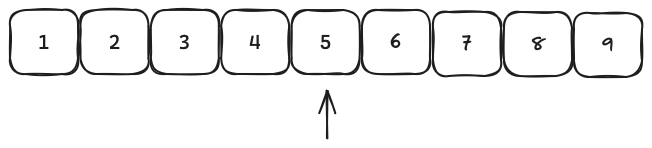
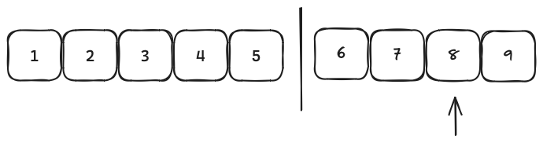

## Interview Skills Series

I’ve been doing a lot of interview prep and studying for technical interviews. And the one topic that always has myself and thousands of other engineers depressed is data structures and algorithms, aka **DSA**.

For some reason companies like to think that DSA and leetcode is the only way to tell someone is good at programming. And those companies are simultaneously correct and incorrect.

There are plenty of examples of folks who get hired into FAANG and ace the interview process because they have memorized DSA and a thousand leetcode questions. But once they get on the job they can’t build anything resilient or performant.

Likewise, there are people like me, who are not great at leetcode questions. But once I’m on the job I understand the business and scalability needs and build really strong systems that perform well under load.

So, I’ve decided enough is enough and I’m cracking out my older copy of [The Algorithm Design Manual](https://amzn.to/422mJjG) I bought back in college, and I’m going to strengthen and maintain my interviewing skills. I will be tagging posts with #interviewing if you care to search for them on my blog.

To start off this series I’m going to go over two very simple search algorithms, and when you would use them in the real world. Simple Search and Binary Search.

## Simple Search

Now, there isn’t really an algorithm called simple search, but I can guarantee you’ve all use this one. If you have an array of data such as \[1,2,3,4,5,6,7,8,9].

Simple search would iterate over every index of the array and comparing the value to what you’re looking for. For simplicity, and to follow general conventions, I’m going to call the array haystack and the target value needle. Find the needle in the haystack.

```
def simple_search(needle, haystack)
 haystack.each.with_index do |val, idx|
 return idx if val == needle
 end
end

...

haystack = [1, 2, 3, 4, 5, 6, 7, 8, 9]
simple_search(8, haystack)
=> 7
```

This returns the index of the array where the needle is found.

This looks fairly innocent for a small dataset like this, but once you scale this to potentially millions of values it slows down considerably.

Using Big Oh notation this is **O(n)**, linear. As the number of values in the array increase, the time required to complete is increased as well.

## Binary Search

Enter Binary Search. Now, there is a caveat to using binary search. The array must already be sorted. Say we have that same array \[1,2,3,4,5,6,7,8,9] and we’re looking for the index of 8. You could iterate over the entire array to get index 7. Or you can use binary search.

```
def binary_search(low, high, needle, haystack)
 return -1 if low > high

 middle = (low+high)/2
 return middle if haystack[middle] == needle

 if haystack[middle] > needle
 return binary_search(low, middle-1, needle, haystack)
 else
 return binary_search(middle+1, high, needle, haystack)
 end
end

...

haystack = [1, 2, 3, 4, 5, 6, 7, 8, 9]
binary_search(0, haystack.length, 8, haystack)
=> 7
```

Walking through this code, we have an array of length 9. So we call binary search against a low of 0, and a high of 9, searching for 8 in the haystack.

(0+9)/2 = 4.5, ruby rounds this down to 4. The value at index 4 is 5



5 does not equal 8 so we continue down. 5 is less than 8 so we enter the else condition and pass the middle index + 1 to set our low index to 5 (the next index after 4).

(5+9)/2 = 7. The value at index 7 is 8. We’ve found our value and return 7.



### Whats the difference?

These both found the same answer, index 7. However, they did it in a different number of steps.

Simple Search took 8 steps to find index 7.\
Binary Search took 2.

Binary search has a run time complexity of **O(log n)**. Admittedly I’m not great at math, so I’m not going to pretend I can explain logarithms. But the general idea that makes an algorithm logarithmic is dividing the set you loop over in half each iteration.

I do this in the calculation of middle `(low+high)/2` and then passing middle+1 or middle-1 in the recursive calls to change the low or high respectively.

### When would you use Binary Search?

In any dataset that is sorted. Page numbers, a word dictionary, phone book, etc..

E.G. If you open a (physical book) dictionary looking for the word **map**, and you open to the B’s, you know M comes after B so you keep your finger in the B section and flip further back. You are now at the Q’s and have gone too far. so you split the difference between B and Q, and repeat this until you find the M’s and eventually the word map.

If you were using simple search, you would scan every single word from A onwards until you found map. Not very efficient eh?

## Conclusion

This was a rather simple algorithm to digest. I obviously already knew what binary search was, but it was nice to refresh memory on it. I will get into more complex algorithms as we go along. I also plan on covering common Design Patterns in software engineering.
