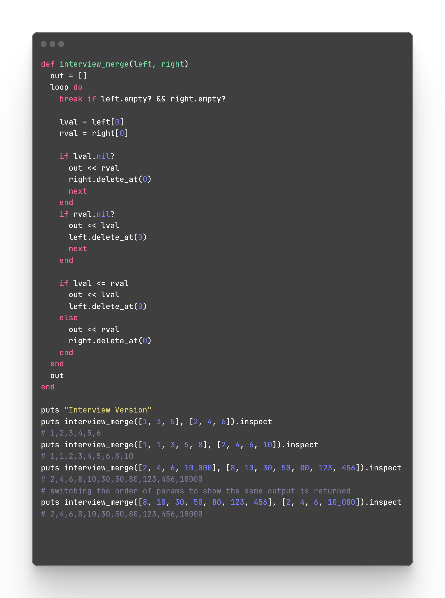
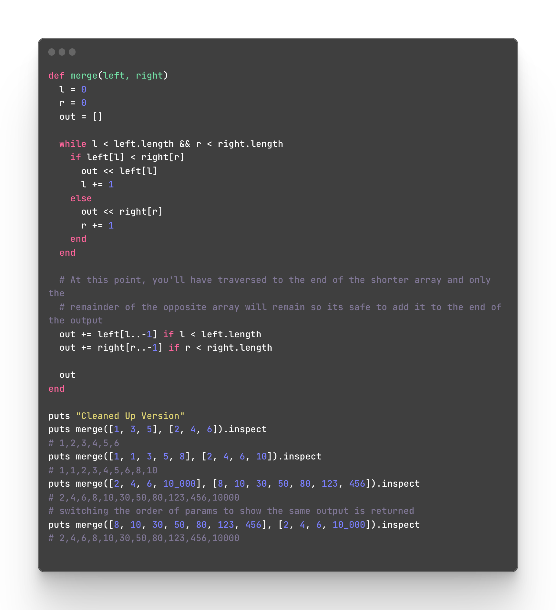

## I think I failed an interview

Technically, as of writing this I don’t know for sure yet if I failed or not… the company hasn’t rejected me officially. However, I definitely feel like I failed myself. This is a relatively easy problem to solve, and I froze in the moment.

So, I decided this evening to suck it up and fix my mistakes. Answer the dreaded question every interviewer asks: “How would you change this?”

Jeremy Winterberg is a reader-supported publication. To receive new posts and support my work, consider becoming a free or paid subscriber.

[Type your email…](<mailto:Type your email…>)Subscribe

I know the engineer who interviewed me had read some of my blog, but I doubt he’ll see this. If you did happen to come back, hi haha 👋. I’m only doing this to learn from my mistakes and become a stronger engineer for the next interview. I hope I don’t get rejected, I think it’s a cool company and would like to work there, but I know this likely won’t change the outcome.

### The coding challenge

> Given two sorted arrays, merge them into one array.

**Constraints**:

- will always contain numbers

- will always be sorted

- will never have nil values

### What I wrote during the interview

At first, I was trying to do something with enumerators and an n^2 solution. My brain froze and he gave me some hints that put me back on track. This is similar to the solution I came up with in the end. It took maybe 15 minutes of our time to get to this solution, and it probably should’ve taken me less than 5 without any hints.

#### What’s wrong with this?

1. There’s duplicated logic over and over.

2. The break point isn’t technically part of the loop.

3. It’s doing extra work by removing the values from the array.

4. It’s not easily readable or maintainable.

### My attempt to fix it

1. I wanted to clean up the logic. So to do that I loop off the length of the arrays and then do the “cleanup” afterwards outside of the while loop.

2. I made the loop a while loop against the lengths of the arrays.

3. No longer removing values from the arrays, only tracking the index we’re looking at for each array in the variables L and R.

4. It’s much shorter and cleaner without duplicated logic. This is much easier to maintain in the future. I wouldn’t leave the comments in there like I did here, but for the purpose of this post I wanted to explain why that was ok to do.

## What did I learn?

Coding wise, not much. The concepts used in the cleaned-up version are nothing new to me. The main differentiator is time. I spent maybe 45 minutes on the new version thinking about and cleaning up the code. I don’t do well under the compressed timeline of technical interviews.

I need to brush up on some common syntax in ruby still. For example, I couldn’t remember how to do a basic loop because I basically always use enumerators.

I’m doing a lot of context switching between programming languages while I work on side projects, and it really threw me off in this interview. I want to continue growing my knowledge of Go, Typescript and React/Nextjs but it might be best if I focus entirely on ruby until I get hired somewhere.

I believe my best chance at getting hired is going to be with a ruby stack because almost all of my experience is in ruby. The market right now doesn’t support engineers who are looking to step outside their primary tech stack unfortunately. Companies can pick an engineer from thousands who are looking for work right now, so they can find someone who matches exactly what they’re looking for with ease.

Jeremy Winterberg is a reader-supported publication. To receive new posts and support my work, consider becoming a free or paid subscriber.

[Type your email…](<mailto:Type your email…>)Subscribe
