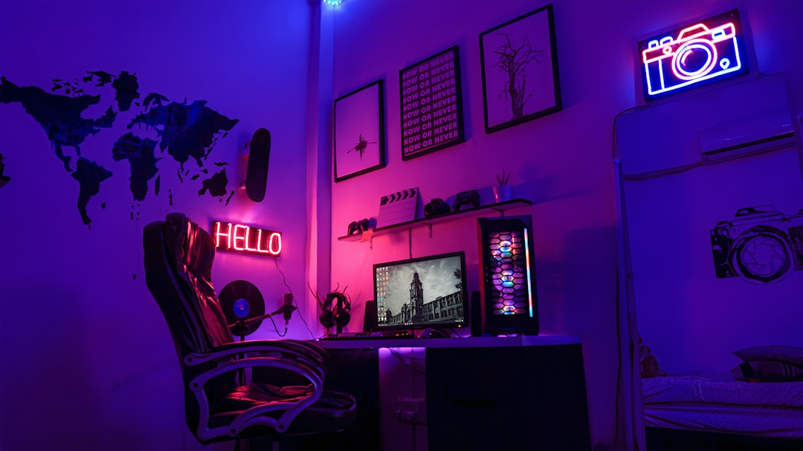
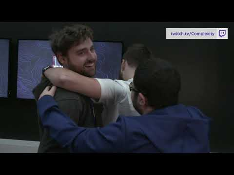
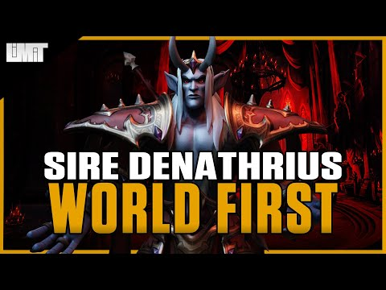

## My Experience With Gaming Addiction

I’ve been a gamer my entire life, like most millennials. The first games I remember playing were Tetris on the original black and white gameboy, DOS computer games like Crystal Cave, Brick Breaker, and Jazz Jackrabbit, and the early NES games like mario bro’s and duck hunt. My whole life I played games till I beat them, then moved on. This is a relatively healthy relationship with games. But then a new genre came to my attention, MMORPG (Massively Multiplayer Online Role-Playing Game).

These are the social games that suck away your life force till you bleed dry. They’re created intentionally to get you to play longer, to use their paid services, to create relationships with friends and rivals, to join the Horde or Alliance against each other as one body. It’s not a new concept that these games are highly addicting. I’ve been playing them since 2005, and I’ve finally said enough.

### Runescape

My first MMORPG was Runescape. I started playing the game because a friend of mine convinced me to try it. Very quickly, I became hooked. From grinding all of my skills to reach quest requirements to logging on every couple of hours to do farm runs. I spent hundreds of hours killing the same monsters in hopes to get the super rare drops. I believe I had over 400 days of game time logged when I finally quit the game after 12 years. There’s another side to that story, my youtube career, which I can touch on another time.

Runescape was my life. All of my friends played that game, which slowly changed to all of my friends were only met online through that game. I slowly lost contact with everyone who lived near me who wasn’t playing runescape. I’m still friends and talk to most of the people I met through gaming. I even was the best man at one of their wedding’s a couple years ago.

But, when you stop doing an activity that takes up all of your free time.. you fill it with something else. Which is when I was introduced to World of Warcraft.

### World of Warcraft

WoW is arguably the largest, most popular MMORPG. Its been around as long as Runescape, but easily has over 5 times the player base across the globe. I started playing wow at the end of Cataclysm, but really my addiction started in Mists of Pandaria in 2012. I was introduced to progression raiding, and have been hooked on that competition since then.

There’s nothing quite like the feeling of working together with a large group of people to clear a raid for the first time. Coming up with strategies, analyzing your gameplay to improve pull after pull, picking up tips from watching other people play on stream or in videos, etc.. its an ecosystem of competition, and I ate it up. I never got to play at any insane level, I peaked at US 37th, and was often in the top 100 players of my class. But the rush is the same regardless of when you get there. Working as a team to fix each small issue till the fight finally clicks and you get the kill. The ferocious war cry of nerd screams is something you just dont experience in any other atmosphere.

## It’s wonderful, until it isn’t.

About 2 years ago I joined a guild that I had looked up to for years. They were often one of the top guilds on my server and had a few big name streamers. It was also the start of my anxiety. I would over analyze everything that people said directly about me. Anything indirect would automatically be assumed to be about me. My brain was convinced that I was trash at the game. I pushed so hard to improve and become an expert at my class, but the thoughts still were there. “Why did this loot get assigned to that person instead of me when its a bigger upgrade for me? They must be thinking about kicking me off the team”.

People in my guild would rarely respond to me. Anytime I would post a suggestion, an opinion, or even joke, they would be met with opposition or simply ignored. I can genuinely say that I only ever had 2 friends in that guild, the rest I still have no clue if they like me or not. This fed into my anxiety and the idea that I didn’t belong there.

This anxiety, and a desire to focus on my career as a software engineer, made me consider quitting the game for a very long time. In DM’s with these friends I talked about how I wanted to step away from the game. What prevented me from biting the bullet came down to a few factors. 1. I didn’t want to leave my team without an adequate replacement for me. 2. I just didn’t quite have a reason to throw away all of my experience and status as a raider at this level yet. When you stop raiding for any amount of time, it is INCREDIBLY hard to get back into it at the same level. You typically have to slum around and work your way back up unless you have connections.

### Nothing lasts forever.

On December 20th, 2020, I was informed I would no longer be on the raid team of my guild. I was welcomed to stay as a friends and family member, but I would not be in on any fight. I raided for progression, farm doesn’t bring the same challenges that make it fun. My anxiety and paranoia believes there were some politics that went into that decision, but I will never truly know if that’s accurate.

When I was given the news, I had a few initial reactions.

- Betrayal: this was the team I’ve been with for 2 years. They discounted all of that time and my experience because I had a rough week where I performed poorly.

- Self-doubt: This was confirmation that my skill level, I was so anxious about, was actually bad, and this wasn’t just in my head.

- Anger: Mad that the people who made the decision weren’t delivering the news. Mad that I was silently being pushed away off the team. Hurt that no one cared that I was removed from the team except 2-3 people.

- Relief: I finally had a reason to quit the game. I responded to the news with my final feedback and advice for the leadership team. The overall gist of it was they need to fix their communication. I posted my farewell to the team in the guild discord channel, cancelled my wow subscription, and uninstalled the game. WoW has been removed from my life after 8 years, and thousands of hours of gametime played.

### How am I doing now?

Its been a few days now, and I’m writing this post as a way to decompress my thoughts. A personal therapy session. In that time I’ve been able to get quite a lot done. I finally got around to doing some workshop upgrades, and was incredibly productive at work. I feel free to do whatever I want to do.

I’m no longer tied down to a Mon-Wed, 7:45-11:30pm raid schedule, with 20 hours of maintenance chores every week. No longer plagued by a constant thought that I need to analyze my gameplay again to see where I could improve. Relief is an understatement of what I’ve felt these past days.

I talked to a friend today and he said I genuinely sounded happier/more upbeat than I have in a long time. I dont know if what I’m feeling is happiness, but I definitely feel great. My stress and anxiety have subsided, and I’m hopeful for the opportunities this will allow me to do.

## What’s my advice?

So, I’ve quit MMORPGs. I do no plan on playing another one any time soon. I highly recommend evaluating what you gain by playing the game like I did. WoW became a job I wasn’t paid to play. I clocked in and out on a set schedule that brought me no joy. I stopped experiencing the nerd cries and instead would sigh in relief that we finally finished. It wasn’t happiness, it was the end of a work day.

If you feel that way, try to remember what made the game fun for you and only do that thing. For me, there was nothing left that was fun. And there’s no point in playing a game, if you’re not having fun.

Good luck my dudes,

Jeremy

> Update 2021: I started playing Runescape again.. but only casually. It’s been pretty healthy so far and I only play when I have time and while I’m having fun.
